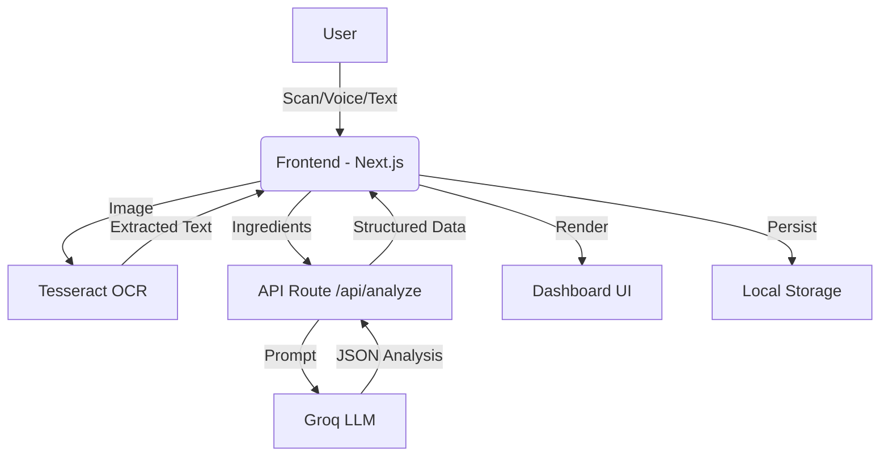

# 🥗 FoodBuddy

### Your AI-Native Food Co-Pilot

**FoodBuddy** is an intelligent web application designed to decode complex food labels. It transforms confusing ingredient lists into clear, actionable insights using Artificial Intelligence. By combining **OCR (Optical Character Recognition)**, **Voice Input**, and **Deep Analysis**, it helps users make healthier decisions in seconds.

---

## 🌍 Problem Statement

Food product labels are often designed to be confusing. Consumers struggle to identify:

* Hidden sugars and artificial additives.
* Allergens or dietary conflicts (Vegan, Keto, Gluten-Free).
* The difference between two similar-looking products.

There is a need for a tool that reduces the **cognitive load** of grocery shopping by acting as a smart assistant that reads, analyzes, and advises.

## 💡 Solution

**FoodBuddy** acts as a personal nutritionist in your pocket. It doesn't just read data; it provides **reasoning-driven verdicts**.

* **Instant Clarity:** Turns chemical names into human-readable explanations.
* **Decision Support:** Compares products side-by-side to declare a winner.
* **Context Aware:** Automatically flags ingredients based on dietary needs (e.g., "Not Keto-friendly").

---

## ✨ Key Features

### 🔍 Multi-Modal Input

* **📸 Smart Label Scanning (OCR):** Upload or snap a photo of an ingredient label to extract text automatically using Tesseract.js.
* **🎙️ Voice Input:** Dictate ingredients hands-free using the built-in microphone.
* **✍️ Manual Input:** Paste text for quick analysis.

### 🧠 Deep Analysis Engine

* **🚦 The Verdict:** Get an instant "Excellent," "Moderate," or "Avoid" rating with a clear explanation.
* **🧪 Ingredient X-Ray:** Visual breakdown of **Natural vs. Processed vs. Additives** composition.
* **🍽️ Dietary Matrix:** Automatic checks for **Vegan**, **Gluten-Free**, and **Keto** compliance.
* **❤️ Health Score:** A dynamic 0-100 score based on ingredient quality.

### ⚔️ Compare Mode (Decision Engine)

* **Head-to-Head Comparison:** Scan two products to see them side-by-side.
* **Winner Declaration:** The AI analyzes trade-offs and declares a healthier option.
* **Key Differences Grid:** Visual comparison of sugar levels, additives, and processing intensity.

### 🛒 Actionable Utilities

* **📝 Smart Shopping List:** Save healthier alternatives found by the AI directly to a built-in checklist.
* **📈 Health Journey:** Track your scanning history and see your health score trends over time (visualized via charts).
* **💬 Interactive Q&A:** Ask follow-up questions like *"Is this safe for toddlers?"* and get AI answers.

---

## 📱 Mobile-First Design

* Fully responsive UI optimized for smartphones.
* Touch-friendly controls and bottom-sheet interactions.
* "Scan & Go" workflow designed for in-store usage.

---

## 🛠️ Tech Stack

* **Frontend:** React, Next.js (App Router), TypeScript
* **Styling:** Custom CSS (Glassmorphism, Minimalist Green/White Theme)
* **AI & Logic:** Groq API (LLM for analysis), Prompt Engineering
* **Visualization:** Recharts (Data visualization for Health Scores & Trends)
* **Utilities:**
* `Tesseract.js` (Optical Character Recognition)
* `Lucide React` (Iconography)
* `Web Speech API` (Voice Recognition)
* `Local Storage` (History & State Persistence)


---

## 🏗️ System Architecture



---

## 🖥️ Running the Project Locally

1. **Clone the repository**
```bash
git clone https://github.com/hereayush/foodbuddy.git
cd foodbuddy

```


2. **Install dependencies**
```bash
npm install

```


3. **Set environment variables**
Create a `.env.local` file in the root directory:
```bash
GROQ_API_KEY=your_api_key_here

```


4. **Run the development server**
```bash
npm run dev

```


5. Open your browser at `http://localhost:3000`

---

## ⚠️ Disclaimer

FoodBuddy provides general informational insights based on ingredient lists. It does not replace professional medical or nutritional advice. Always consult a doctor for severe allergies or dietary conditions.

## 🚀 Future Scope

* **UPC Barcode API:** Integration with OpenFoodFacts for instant barcode lookup.
* **Carbon Footprint:** Estimating the environmental impact of ingredients.
* **Multi-Language Support:** Translating foreign ingredient labels instantly.

---

Made with 💚 by **Ayush Kumar Gupta**
